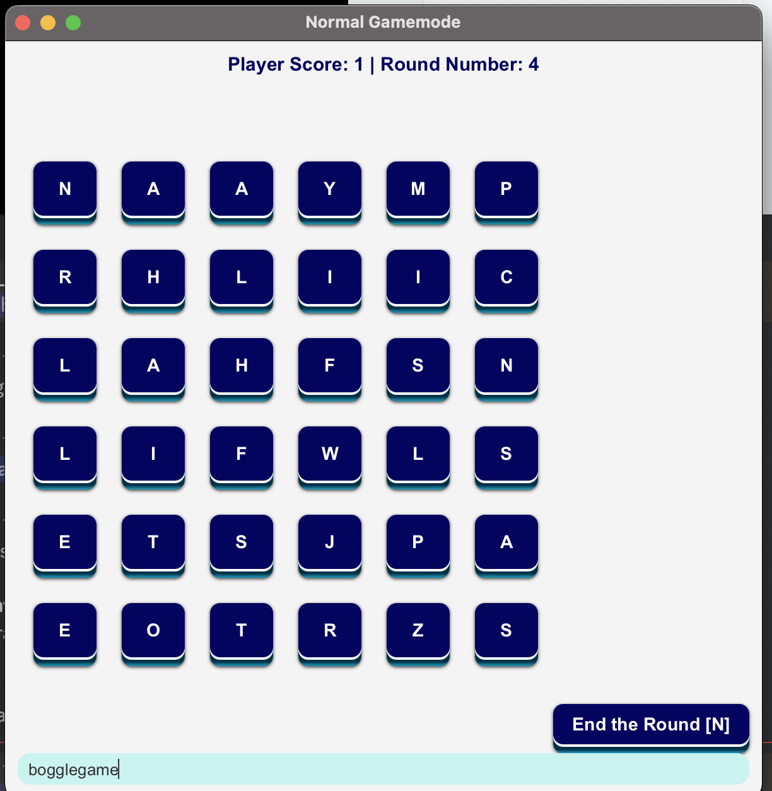

[![Contributors][contributors-shield]][contributors-url]
[![Issues][issues-shield]][issues-url]

<!-- PROJECT LOGO -->
 

  
  <h1 align="center">Boggle Game</h1>

  

    A boggle game with an interactive User-Interface and Real-Time In-Game Stats!
     
     
    <a href="https://github.com/hussaino03/CSC207-Project"><strong>Explore the docs »</strong></a>
  

<!-- TABLE OF CONTENTS -->

  
Table of Contents

   
   
  <ol>
    <li>
      <a href="#about-the-project">About The Project</a>
      <ul>
        <li><a href="#built-with">Built With</a></li>
      </ul>
    </li>
    <li>
      <a href="#getting-started">Getting Started</a>
      <ul>
        <li><a href="#prerequisites">Prerequisites</a></li>
      </ul>
    </li>
    <li><a href="#team">Usage</a></li>
    <li><a href="#roadmap">Roadmap</a></li>
  </ol>

<!-- ABOUT THE PROJECT -->

### Features:

* Real-time stats for the current round the user is on
* Grid Selection Scene (3 choices for grid sizes).
* All-time stats page which gets updated with the user's stats written to a separate file, as well.
* Accessibility Options (Keyboard based inputs/commands only).
* Friendly and Interactive UI 
* Each round statistics 
* The game statistics, after the user chooses to end the current round 
* How-to-play scene which briefly describes the game
* Easy-access throughout different scenes with buttons either linking to main screen or the corresponding scene 

### Built With

* Java
* JavaFx
* CSS

<!-- GETTING STARTED -->
# Getting Started

<!-- PREREQUISITES -->
## Prerequisites
* Install JavaFX components 

<!-- ROADMAP -->
## Roadmap

- [✅] Sprint 1
- [✅] Sprint 2
- [✅] Sprint 3
- [✅] Sprint 4

## Team

* Hussain
* Sebastian
* Ved
* Usman

<!-- MARKDOWN LINKS & IMAGES -->
<!-- https://www.markdownguide.org/basic-syntax/#reference-style-links -->
[contributors-shield]: https://img.shields.io/github/contributors/hussaino03/CSC207-Project?color=%23&style=for-the-badge
[contributors-url]: https://github.com/hussaino03/CSC207-Project/graphs/contributors
[issues-shield]: https://img.shields.io/github/issues/hussaino03/CSC207-Project?style=for-the-badge
[issues-url]: https://github.com/hussaino03/CSC207-Project/issues
[product-screenshot]: loginpage.png
